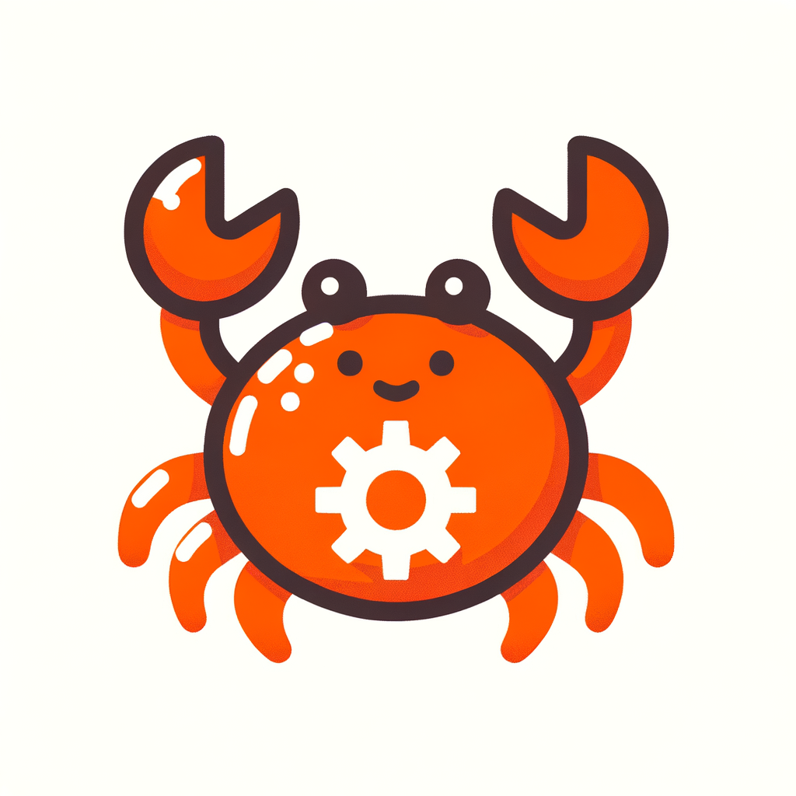

<p align="center">
  
</p>

<h1 align="center">Rust: Do Zero ao Júnior</h1>

<p align="center">
  <strong>Roadmap completo e interativo para dominar Rust</strong>
</p>

<p align="center">
  <a href="#-sobre">Sobre</a> •
  <a href="#-funcionalidades">Funcionalidades</a> •
  <a href="#-módulos">Módulos</a> •
  <a href="#-como-usar">Como Usar</a> •
  <a href="#-estrutura">Estrutura</a> •
  <a href="#-contribuindo">Contribuindo</a>
</p>

<p align="center">
  
  
  
  
</p>

---

## Sobre

**Rust: Do Zero ao Júnior** é um roadmap profissional e didático para aprender a linguagem Rust, voltado para a comunidade brasileira. O projeto oferece uma experiência de aprendizado completa através de um site interativo, um jogo educativo e dezenas de exercícios práticos.

### Por que Rust?

- **Segurança de Memória** — Previne bugs como null pointer e data races em tempo de compilação
- **Performance** — Velocidade comparável a C/C++ sem garbage collector
- **Produtividade** — Mensagens de erro claras e excelente tooling
- **Mercado** — Linguagem mais amada por 8 anos consecutivos no Stack Overflow

---

## Funcionalidades

### Site Interativo
- Design moderno e responsivo com tema escuro
- Barra de progresso de leitura
- Animações suaves e efeitos visuais
- Exemplos de código com syntax highlighting
- Botão de copiar código em todos os blocos
- Navegação fixa e índice interativo

### Rust Crab Game
- Jogo educativo com 50 níveis progressivos
- Sistema de dicas em 3 níveis
- Feedback instantâneo com explicações detalhadas
- Detecção de erros comuns com correções
- Progresso salvo automaticamente

### Rust Assistant (Chat com IA)
- Tutor de Rust com inteligência artificial
- Respostas em português brasileiro
- Exemplos de código com syntax highlighting
- Histórico de conversa mantido na sessão
- Sugestões de perguntas para começar

### Exercícios Práticos
- 50 exercícios cobrindo todos os conceitos essenciais
- Organizados por dificuldade e categoria
- Múltiplas respostas aceitas por exercício
- Explicações detalhadas após cada resposta

---

## Módulos

| # | Módulo | Descrição |
|---|--------|-----------|
| 01 | **Introdução** | O que é programação e por que aprender Rust |
| 02 | **Primeiros Passos** | Instalação, Cargo e Hello World |
| 03 | **Fundamentos** | Variáveis, tipos, mutabilidade e operadores |
| 04 | **Controle de Fluxo** | if/else, match e loops |
| 05 | **Funções** | Declaração, parâmetros, retorno e expressões |
| 06 | **Estruturas de Dados** | Arrays, Vectors, Tuplas e HashMap |
| 07 | **Ownership** | O conceito mais importante do Rust |
| 08 | **Structs & Enums** | Tipos personalizados e pattern matching |
| 09 | **Tratamento de Erros** | Option, Result e propagação com `?` |
| 10 | **Traits & Generics** | Interfaces e programação genérica |
| 11 | **Arquivos & I/O** | Leitura e escrita de arquivos |
| 12 | **Concorrência** | Threads e channels |
| 13 | **Testes** | Testes unitários e de integração |
| 14 | **Ecossistema** | Crates populares e dependências |
| 15 | **Projetos** | 5 projetos práticos guiados |
| 16 | **Carreira** | Dicas para o mercado de trabalho |
| 17 | **FAQ** | Dúvidas frequentes |
| 18 | **Referências** | Links e recursos adicionais |

---

## Como Usar

### Online

Acesse diretamente pelo navegador — basta abrir o arquivo `index.html` ou hospedar em qualquer servidor estático.

### Local

```bash
# Clone o repositório
git clone https://github.com/seu-usuario/rust-roadmap.git

# Entre no diretório
cd rust-roadmap

# Abra no navegador (Linux/Mac)
open index.html

# Ou use um servidor local
python -m http.server 8000
# Acesse: http://localhost:8000
```

### Páginas Disponíveis

| Página | Descrição |
|--------|-----------|
| `index.html` | Roadmap principal com todos os módulos |
| `chat.html` | Tutor de Rust com IA (Rust Assistant) |
| `game.html` | Jogo interativo "Rust Crab" |

---

## Estrutura

```
rust-roadmap/
├── index.html              # Página principal do roadmap
├── chat.html               # Tutor de Rust com IA
├── game.html               # Jogo educativo Rust Crab
├── logo.png                # Logo do projeto
├── favicon.ico             # Favicon
├── favicon-16.png          # Favicon 16x16
├── favicon-32.png          # Favicon 32x32
├── apple-touch-icon.png    # Ícone para iOS
├── logo-192.png            # Ícone PWA 192x192
├── logo-512.png            # Ícone PWA 512x512
├── exercises/
│   ├── rust_game_exercises.json   # Dados dos exercícios
│   └── EXERCISES_GUIDE.md         # Guia detalhado dos exercícios
└── rust-concepts-guide.md  # Guia adicional de conceitos
```

---

## Tecnologias

O projeto foi construído com tecnologias web puras, sem dependências externas:

- **HTML5** — Estrutura semântica
- **CSS3** — Design responsivo com variáveis CSS e animações
- **JavaScript** — Interatividade e lógica do jogo
- **Highlight.js** — Syntax highlighting para código Rust

---

## Projetos Práticos Incluídos

1. **To-Do List CLI** — Lista de tarefas no terminal
2. **Conversor de Moedas** — Conversão entre moedas
3. **Jogo de Adivinhação** — Adivinhe o número secreto
4. **API REST** — CRUD com Actix-web ou Axum
5. **CRUD com Persistência** — Projeto final com SQLite

---

## Recursos Externos Recomendados

- [The Rust Book](https://doc.rust-lang.org/book/) — Documentação oficial
- [Rust By Example](https://doc.rust-lang.org/rust-by-example/) — Aprendizado por exemplos
- [Rustlings](https://github.com/rust-lang/rustlings) — Exercícios interativos
- [Crates.io](https://crates.io) — Registro de pacotes Rust
- [Rust Playground](https://play.rust-lang.org) — Editor online

---

## Contribuindo

Contribuições são bem-vindas! Sinta-se à vontade para:

1. Reportar bugs ou sugerir melhorias abrindo uma [issue](../../issues)
2. Enviar pull requests com correções ou novos conteúdos
3. Compartilhar o projeto com a comunidade

### Diretrizes

- Mantenha o conteúdo em português brasileiro
- Siga o estilo de código existente
- Teste suas alterações em diferentes navegadores
- Atualize a documentação quando necessário

---

## Licença

Este projeto é de código aberto e está disponível para uso educacional.

---

<p align="center">
  Feito com dedicação para a comunidade Rust brasileira
</p>

<p align="center">
  
</p>
